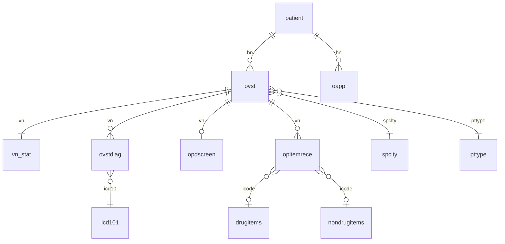

# HosXP OPD Tables

Skill นี้เป็น **schema reference สำหรับผู้ป่วยนอก (OPD)** — ใช้คู่กับ [hosxp-dashboard](../hosxp-dashboard/SKILL.md) เหลัก

## ก่อน query

1. **Default DB**: clinical data → `queryMysql()` (DB1)
2. **Schema อาจต่างตาม site/version** — ยืนยันด้วย `DESCRIBE <table>` ก่อน
3. **Read-only** — ห้าม INSERT/UPDATE/DELETE ลง HosXP โดยไม่ได้รับอนุญาต
4. **Parameterized queries เท่านั้น** — MySQL ใช้ `?`

```sql
-- ตรวจ version schema
SELECT value FROM sys_var WHERE sys_name = 'current_db_structure_version';
DESCRIBE ovst;
```

## คีย์หลัก (Join Keys)

| Key | ความหมาย | ใช้เชื่อม |
|-----|----------|----------|
| `hn` | Hospital Number | `patient`, `ovst`, `oapp`, `opitemrece` |
| `vn` | Visit Number (OPD visit หนึ่งครั้ง) | `ovst`, `vn_stat`, `ovstdiag`, `opdscreen`, `opitemrece`, `service_time` |
| `spclty` | รหัสแผนก | `ovst` → `spclty.name` |
| `pttype` | รหัสสิทธิการรักษา | `ovst` → `pttype.name` |
| `icode` | รหัสยา/หัตถการ | `opitemrece` → `drugitems` / `nondrugitems` |
| `icd10` | รหัสวินิจฉัย | `ovstdiag` → `icd101` |

**Flow หลัก**: `patient` → `ovst` (เปิด visit) → `vn_stat` + `ovstdiag` + `opdscreen` + `opitemrece`

## ตาราง OPD ตามกลุ่ม

| กลุ่ม | ตาราง | หน้าที่ |
|------|-------|--------|
| ทะเบียน | `patient`, `ptcardno` | ข้อมูลผู้ป่วย |
| Visit | `ovst`, `vn_stat`, `ovstost`, `ovstist` | เปิด visit, สถานะ, ค่าใช้จ่าย |
| ซักประวัติ | `opdscreen`, `opdscreening` | vital signs, CC, PE |
| วินิจฉัย | `ovstdiag`, `icd101`, `icd9cm1`, `diagtype` | ICD-10/9 ต่อ visit |
| สิทธิ | `pttype`, `pttypeno`, `pttype_multi` | สิทธิการรักษา |
| แผนก/คลินิก | `spclty`, `kskdepartment`, `clinic` | แผนก, จุดส่งตรวจ, คลินิก |
| นัด | `oapp` | นัดหมาย |
| สั่งยา/ค่ารักษา | `opitemrece`, `drugitems`, `nondrugitems`, `drugusage`, `paidst` | รายการยา/หัตถการ/ค่าบริการ |
| แล็บ | `lab_head`, `lab_order`, `lab_items` | สั่งและผล lab |
| X-ray | `xray_head`, `xray_report`, `xray_items` | สั่งและผล x-ray |
| เวลาบริการ | `service_time`, `ovst_department` | timestamp แต่ละจุดบริการ |
| การเงิน | `rcpt_print`, `rcpt_print_detail` | ใบเสร็จ |

รายละเอียด column ทุกตาราง → [reference.md](reference.md)

## Query Patterns ที่ใช้บ่อย

### OPD วันนี้ (รายชื่อ)

```sql
SELECT o.vn, o.hn, o.vstdate, o.vsttime, o.spclty, s.name AS spclty_name,
       p.pname, p.fname, p.lname, o.pttype, o.ovstost
FROM ovst o
JOIN patient p ON p.hn = o.hn
LEFT JOIN spclty s ON s.spclty = o.spclty
WHERE o.vstdate = CURDATE()
ORDER BY o.vsttime DESC
LIMIT 100
```

### Visit + วินิจฉัยหลัก + ค่าใช้จ่าย

```sql
SELECT o.vn, o.hn, o.vstdate, v.pdx, v.income, v.paid_money, v.remain_money,
       p.fname, p.lname
FROM ovst o
JOIN vn_stat v ON v.vn = o.vn
JOIN patient p ON p.hn = o.hn
WHERE o.vn = ?
```

### วินิจฉัยทั้งหมดของ visit

```sql
SELECT d.vn, d.icd10, d.diagtype, i.name AS icd10_name
FROM ovstdiag d
LEFT JOIN icd101 i ON i.code = d.icd10
WHERE d.vn = ?
ORDER BY d.diagtype
```

### รายการยา/หัตถการของ visit

```sql
SELECT r.vn, r.icode, r.qty, r.unitprice, r.sum_price,
       COALESCE(d.name, n.name) AS item_name, r.paidst
FROM opitemrece r
LEFT JOIN drugitems d ON d.icode = r.icode
LEFT JOIN nondrugitems n ON n.icode = r.icode
WHERE r.vn = ?
ORDER BY r.rxtime
```

### OPD รายสัปดาห์ (chart)

```sql
SELECT DATE(vstdate) AS day, COUNT(*) AS count
FROM ovst
WHERE vstdate >= DATE_SUB(CURDATE(), INTERVAL 6 DAY)
GROUP BY DATE(vstdate)
ORDER BY day
```

### นัดหมายวันนี้

```sql
SELECT a.hn, a.nextdate, a.nexttime, a.clinic, c.name AS clinic_name,
       p.fname, p.lname, a.note
FROM oapp a
JOIN patient p ON p.hn = a.hn
LEFT JOIN clinic c ON c.clinic = a.clinic
WHERE a.nextdate = CURDATE()
ORDER BY a.nexttime
```

## TypeScript Types (ตัวอย่าง)

```tsx
type OvstRow = {
  vn: string;
  hn: string;
  vstdate: string;
  vsttime: string;
  spclty: string | null;
  pttype: string | null;
  ovstost: string | null;
  doctor: string | null;
  oqueue: number | null;
};

type VnStatRow = {
  vn: string;
  hn: string;
  pdx: string | null;
  income: number | null;
  paid_money: number | null;
  remain_money: number | null;
  age_y: number | null;
};

type OvstdiagRow = {
  vn: string;
  icd10: string;
  diagtype: string;
  hn: string | null;
};
```

## ER Diagram (OPD Core)



## เมื่อไหร่ควรอ่าน reference.md

- ต้องการ column ครบของตารางใดตารางหนึ่ง
- Join ข้าม module (lab, xray, การเงิน)
- ไม่แน่ใจ field สำหรับ filter (เช่น `ovstost`, `paidst`, `diagtype`)
- สร้างรายงาน OPD ซับซ้อน (506, สิทธิ UC, คลินิกเรื้อรัง)

## เอกสารที่เกี่ยวข้อง

- Column ละเอียดทุกตาราง OPD → [reference.md](reference.md)
- UI/dashboard conventions → [hosxp-dashboard/SKILL.md](../hosxp-dashboard/SKILL.md)
- Dashboard stat queries → [hosxp-dashboard/reference.md](../hosxp-dashboard/reference.md#dashboard-queries)
